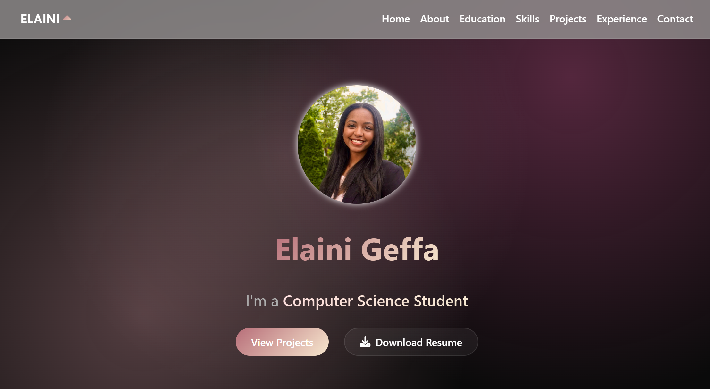

# 💼 Elaini Geffa — Personal Website

Welcome to my personal website! This website is made to showcase my software engineering projects, technical skills, and professional experience. It is specifically designed for recruiters, mentors, and potential collaborators to learn more about my background, capabilities, and ongoing work in Computer Science at Virginia Tech.

---

## 🔗 Visit my Live Site

https://elainigeffa.com

---

## 🫣 Take a Peak

---

## 📌 Features

- Sections for about me, skills, experience, projects, and contact
- Navigation bar
- User friendly and responsive design for desktop and mobile
- Clean, accessible layout built using HTML and CSS
- Elegant glassmorphism design
- Smooth scroll and animation effects
- Dynamic typing subtitle effect
- Headshot image display in a circular frame

---

## 🛠 Built With

- HTML
- CSS
- Git + GitHub
- Visual Studio Code
- S3
- Route 53
- IAM
- CloudFront
- AWS Certificate Manager
